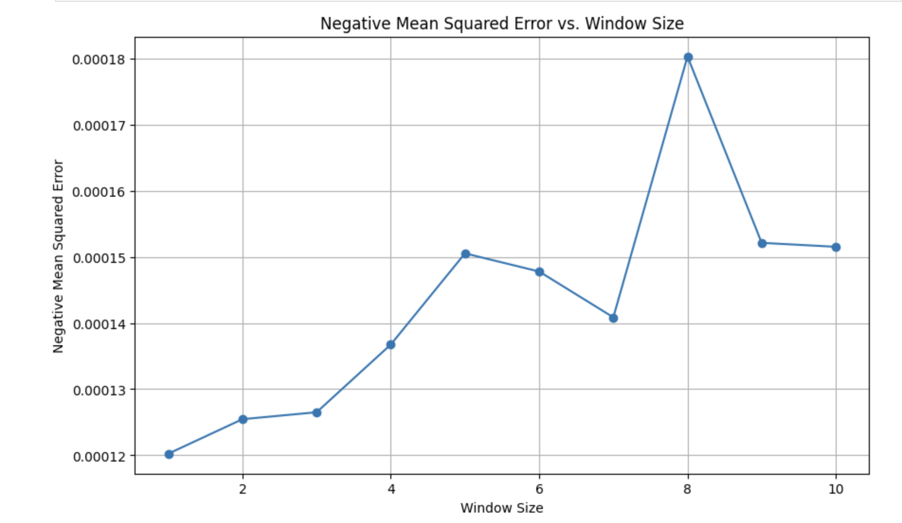
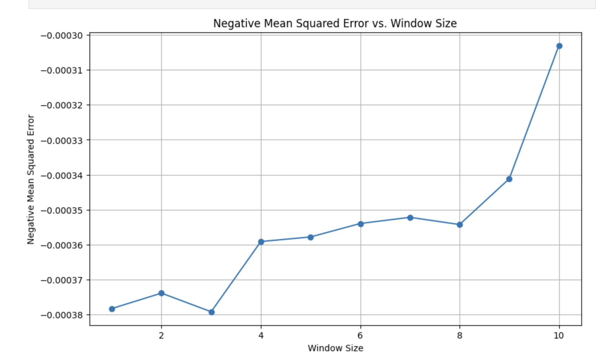
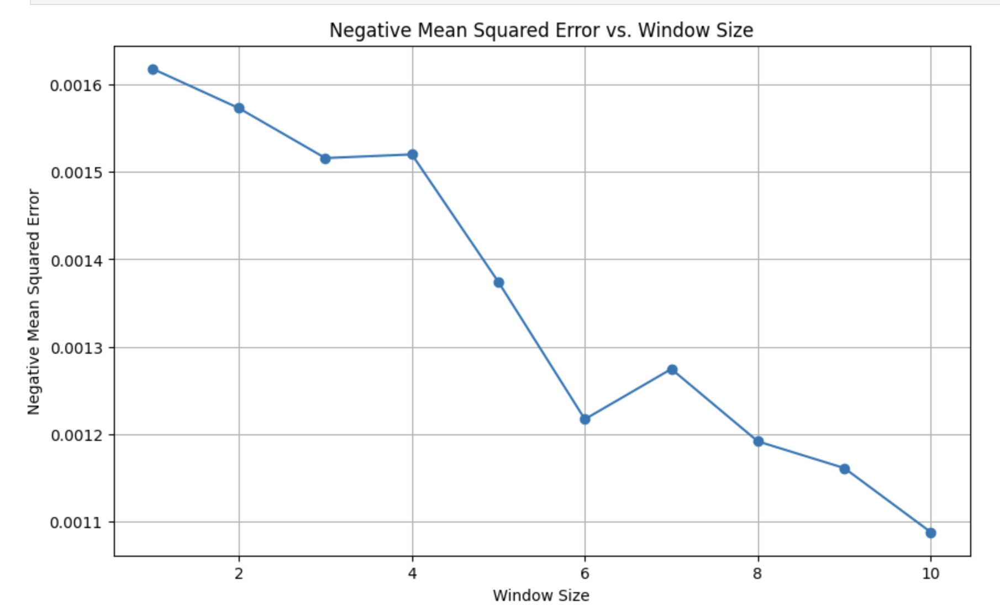

# Time_Series_Analysis

## Problem Statement
- Compare different models for time series analysis against the ARIMA baseline to determine the most effective forecasting model.

- **Evaluation Criteria:** 
  - Performance based on test-error metrics.
  - Compare accuracy of each model against ARIMA's baseline to assess relative effectiveness.
  
- Identify the optimal model for time series analysis, enhancing predictive capabilities and informing data-driven decision-making processes.

## Methodology
- **Data Splitting:**
  - Standard convention: 70-15-15 split for stocks data.
  - **Train:** First 70% of data.
    - Ensures the model is trained on a significant portion of historical data, capturing underlying trends and patterns.
  - **Validation:** Next 15% of data.
    - Used to fine-tune model hyperparameters and prevent overfitting.
  - **Test:** Last 15% of data.
    - Reserved for final model evaluation, assessing its generalization performance on unseen data.
  - Sequential split maintains temporal continuity, crucial for time series analysis where current output depends on previous output.

- **Model-Specific Hyperparameter Tuning:**
  1. **Auto ARIMA:**
      - **Methodology:**
        - Utilizes automated search to determine optimal ARIMA model parameters.
        - **Parameters:**
          - *start_p, start_q:* Initial values for the AR(p) and MA(q) parameters.
          - *test:* Method for selecting the best model based on statistical tests ('adf' for Augmented Dickey-Fuller).
          - *max_p, max_q:* Maximum values for AR(p) and MA(q) parameters.
          - *m:* Frequency of series (set to 1 for non-seasonal data).
          - *d:* Degree of differencing (automatically determined if set to None).
          - *seasonal:* Indicates whether the model should include seasonal components (set to False for non-seasonal data).
          - *start_P, D:* Initial values for seasonal AR(P) and seasonal differencing.
          - *trace:* Whether to print diagnostic information during the fitting process.
          - *error_action:* Action to take if an error occurs during fitting ('ignore' to suppress errors).
          - *suppress_warnings:* Whether to suppress ARIMA warnings.
          - *stepwise:* Whether to use a stepwise approach for model selection.
        
      - **Summary and Diagnostics:**
        - Generates a summary of the fitted model's parameters and statistics.
        - Plots diagnostic information to assess model assumptions and performance.
  2. **Random Forest:**
     - **Technique:** Grid search.
       - Exhaustively searches hyperparameter space to find the best combination.
     - **Hyperparameters:**
       - *Maximum Depth of Tree:*
         - Controls the depth of individual decision trees in the ensemble.
       - *Minimum Number of Splits:*
         - Specifies the minimum number of samples required to split an internal node.
       - *Minimum Samples in Leaf:*
         - Sets the minimum number of samples required to be at a leaf node.
       - *Window Size:*
         - Determines the size of the window used for input feature generation.
  
  3. **Neural Network:**
     - **Technique:** Greedy search.
       - Iteratively explores hyperparameter space, selecting the locally optimal choice at each step.
     - **Hyperparameters:**
       - *Learning Rates:*
         - Rate at which the model adapts to new information during training.
       - *Depth:*
         - Number of layers in the neural network architecture.
       - *Activation Function:*
         - Non-linear function applied to the output of each neuron, introducing non-linearity into the model.
       - *Units in Each Layer:*
         - Number of neurons in each layer of the neural network.
       - *Window Size:*
         - Ensures the model captures temporal dependencies by specifying the size of the input window.
  
  4. **Support Vector Regression (SVR):**
     - **Technique:** Grid search.
       - Systematically explores hyperparameter combinations to find the best configuration.
     - **Hyperparameters:**
       - *C Values:*
         - Penalty parameter of the error term, controlling the trade-off between smoothness and accuracy.
       - *Gamma Values:*
         - Kernel coefficient for 'rbf', 'poly', and 'sigmoid' kernels.
       - *Kernel Values:*
         - Specifies the kernel type used in the algorithm.
       - *Window Size:*
         - Incorporated to ensure the model captures temporal dynamics effectively.

These techniques are employed to train models on the training dataset and optimize their hyperparameters, ensuring the models' effectiveness in capturing underlying patterns and making accurate predictions in the time series domain.

## Experimental Results and Validation
- The errors obtained during model tuning on the cross-validation set are as follows:

  1) **Random Forest:** 0.00023
  2) **Neural Networks:** 0.00045
  3) **SVR:** 0.003934

- Upon individual analysis of the models:

  1) **Neural Networks:** The error initially decreased with increasing window size, reaching a minimum before rising again.

      

  2) **Random Forest:** Similar to neural networks, the error initially decreased with window size before rising.

      
  3) **SVR:** Contrary to expectations, the error continued to decrease with increasing window size, indicating potential overfitting.

      

- While neural networks and random forest effectively managed errors, SVR exhibited unexpected behavior, resulting in error rates approximately 10 times higher.

## Conclusion and Future Work
- The random forest model outperformed others during cross-validation, demonstrating its superiority as the best hypothesis class.

- On the test dataset, our final model achieved a lower error rate of 3.03% compared to the ARIMA baseline's 3.68%.

- This confirms our model's accuracy, surpassing or at least matching ARIMA's performance, thereby providing a robust solution for time series analysis.

## Credits
- Rhythm Bansal (2021A7PS2430G)
- Ameya Kasture (2021A7PS2058G)
- Shivam Agarwal (2021A7PS2909G)
- Patel Dharmik Rohitkumar (2020A7PS0085G)

